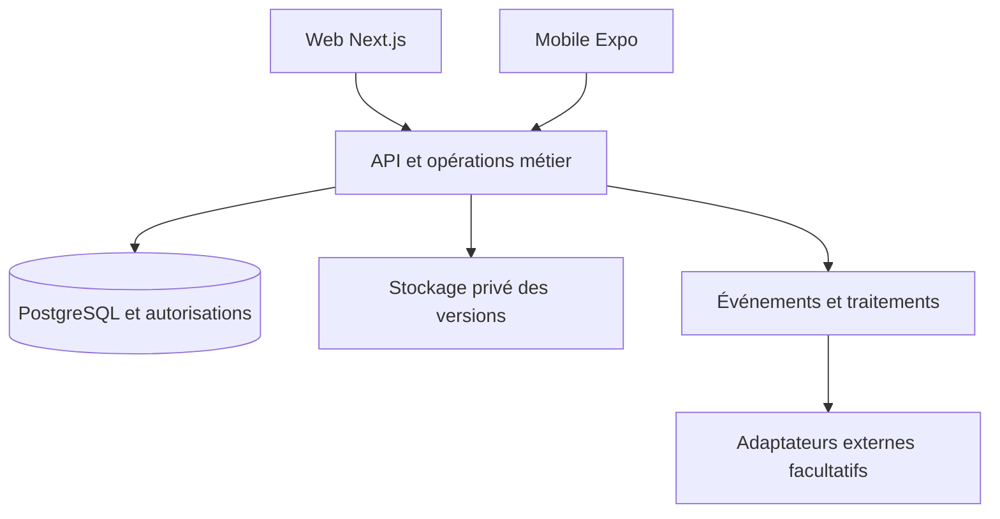

# Architecture technique proposée pour CELESTE OS

Version 0.1.0 · 2 octobre 2026 · Statut proposé pour revue · Responsable de validation Steve

## Choix de travail

Monorepo TypeScript, Next.js pour le web, React Native avec Expo pour iOS et Android, Supabase pour Auth, PostgreSQL et stockage privé. Cette proposition suit la direction discutée ; elle est consignée comme architecture à confirmer au démarrage. Hébergement web à choisir entre les services accessibles selon coût, preview, secrets et retour arrière, avec Vercel comme candidat.

Les types, validations, calculs purs, client API et tokens sont partagés. Les composants DOM Next.js et natifs React Native ne sont pas supposés interchangeables. Le serveur contrôle la finance et les autorisations ; les calculs partagés servent à la prévisualisation et aux tests, jamais à contourner la sécurité. Un backend commun ne signifie pas interface unique.

## Structure cible

| Chemin | Contenu |
|---|---|
| apps/web | Interface Next.js et routes web spécifiques |
| apps/mobile | Expo, routes et composants natifs |
| packages/domain | Calculs financiers purs, transitions et règles sans accès réseau |
| packages/contracts | Types de commandes, validation, codes d’erreur et schémas de réponse |
| packages/api-client | Accès backend partagé sans secret serveur |
| packages/design-tokens | Couleurs, typographie, rayons et espacements |
| packages/ui-web | Composants DOM |
| packages/ui-native | Composants React Native |
| backend/supabase | Configuration, fonctions, migrations et tests de base |
| integrations | Adaptateurs storage, calendar et knowledge |
| docs et planning | Spécifications, décisions, backlog et recette |
| memory et reports | État de reprise et preuves de travail |
| .github | Modèles PR, issues et workflows futurs |

Ces chemins décrivent la structure prévue. Cette livraison contient la documentation et ses modèles, pas les applications ou un environnement Supabase configuré.

## Accès aux données

Les lectures simples peuvent passer par le client Supabase avec droits minimaux et RLS. Les écritures sensibles passent par des commandes métier authentifiées : confirmation de dépense, versement, remboursement, changement d’accès et publication documentaire. Chaque commande vérifie acteur, organisation, périmètre, validation métier et version attendue. L’effet métier, journal et événement sortant sont persistés dans une transaction.

La clé secrète ou service_role reste côté serveur. Une clé publique ne dispense pas des politiques RLS. Aucun rôle envoyé par le client ni user_metadata modifiable ne décide des autorisations. Les vues analytiques respectent les mêmes droits que les tables sous-jacentes. Les changements de droits effectifs sont relus pour les opérations sensibles afin de ne pas dépendre uniquement de claims JWT anciens.

## Contrats d’opérations

| Commande | Entrée essentielle | Résultat |
|---|---|---|
| createExpenseDraft | Organisation, montant, devise, source, catégorie et périmètre | ID, version et état brouillon |
| confirmExpense | ID, version attendue et clé d’idempotence | Dépense confirmée et effets financiers atomiques |
| recordFundDeposit | Fondateur, compte, montant, référence et clé | Contribution et mouvement de caisse liés |
| payReimbursement | Demande, montant, compte, version et clé | Paiement, dette restante et mouvement liés |
| reserveDocumentUpload | Document, nom, taille et MIME | Réservation privée avec expiration |
| finalizeDocumentVersion | Réservation, empreinte attendue et clé | Version figée ou motif d’échec |
| publishDocumentVersion | Version, approbation et version document attendue | Nouvelle référence courante atomique |
| revokeMembership | Membre et motif | Droits retirés et événement d’audit |

Erreurs communes : UNAUTHENTICATED, FORBIDDEN, VALIDATION_ERROR, VERSION_CONFLICT, IDEMPOTENCY_CONFLICT, INSUFFICIENT_FUNDS, UPLOAD_INCOMPLETE. L’API ne transmet pas des détails internes permettant de découvrir une ressource interdite. Les noms sont des contrats proposés, pas des endpoints déjà déployés.

## Traitements asynchrones

Une table outbox porte les événements après commit, avec clé de déduplication, état, tentative et prochaine échéance. Les notifications et connecteurs traitent ces événements sans remettre en cause une dépense déjà confirmée. Les erreurs se réessaient avec délai croissant et limite, puis deviennent visibles à l’administration. La documentation publie exactement quels événements sont synchronisés.

## Environnements et livraison

Local et CI utilisent données synthétiques. Staging et production sont séparés. Les secrets ne sont pas versionnés. Les migrations sont suivies dans GitHub, testées depuis une base vide et sur la version précédente. Versions de Node, gestionnaire de paquets et dépendances fixées avec lockfile après vérification des versions compatibles. Toute commande réelle est enregistrée dans BOOTSTRAP après exécution.

## Alternative à examiner à J1

Une app Expo universelle avec interface web pourrait réduire le nombre de composants. Elle se choisit si les écrans web nécessaires, la gestion des documents, l’accessibilité et les contraintes d’hébergement sont vérifiés. Maintenir Next.js et Expo reste le choix de travail tant qu’aucune preuve ne justifie de le changer. Le choix est documenté avant le scaffold, sans refaire le débat sur la nécessité de CELESTE OS.
